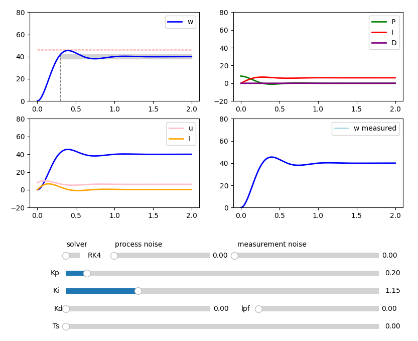

# PID motor simulation

## Description

Interactive simulation of a PID controlled DC motor.

## Details and features
This simulation was created as the final project for the course "Classical simulation methods in physics" in the University of Turku. It aims to demonstrate visually the effects of varying the different parameters of a PID controlled DC motor. 

   
    <p><em>Figure 1: Simulation user interface.</em></p>

The simulation window consists four plots and a set of sliders each explained in greater detail below.

### First plot (upper left)
The first plot shows the angular velocity (w) of the motor in arbitrary units against time in seconds. The red dashed line shows the 15 % overshoot limit calculated from the target velocity. The grey area below is the +-5 % settling limit. The grey vertical line is used to indicate the settling time limit set at 0.3 seconds. This plot can be used to asses the general PID controller performance.

### Second plot (upper right)
The second plot consists of the proportional (P), integral (I), and derivative (D) components of the control signal. This plot can be used to observe the effects of different configuration on each individual control signal.

### Third plot (lower left)
The third plot shows again the angular velocity (w) of the motor in blue, but also the total control signal (u) in pink and the armature current (I) in orange. This plot can be used to observe the relationship between the control signal and the motor response.

### Fourth plot (lower right)
The fourth plot shows the actual angular velocity of the motor (w) and the measured angular velocity (w measured). As with all real systems, the measured values will differ from the actual values depending on the sensor used to measure these physical quantities. In this simulation, sensor noise can be increased or decreased to observe this phenomenon and how it affects the controllability of the system.

### Sliders

#### solver
This slider is used to choose between the differential equation solver. The options are the 4th order Runge-Kutta method and the Euler method. The latter is recommended for slower computers.

#### process noise
This slider is used to adjust the process noise. In this simulation, the process noise is modelled as low-pass filtered Gaussian noise. It can be physically interpreted as low frequency noise on the motor load.

#### measurement noise
This slider is used to adjust the measurement noise, which is modelled as Gaussian noise. This corresponds to sensor noise.

#### Kp
This slider is used to adjust the proportional gain (Kp) of the controller.

#### Ki
This slider is used to adjust the integral gain (Ki) of the controller.

#### Kd
This slider is used to adjust the derivative gain (Kd) of the controller.

#### lpf
This slider is used to adjust the strength of the 1st order low-pass filter implemented in the simulation. The slider determines the weighing between the current and the previous value.

#### Ts
This slider is used to adjust the controller sample time. In real systems, the controller sends commands at discrete time intervals. This slider can be used to observe the effects of the sample time on the system performance.

## Additional documents
I have also included an _abridged_ version of the project report in the documents folder that explains PID controllers, DC motor modelling, and some of the design choices in more detail. You can find the document [here](docs/project_report_abridged.pdf).

## Installation

### 1. Clone the repository:
To clone this project to your local machine, run the following command:
```
git clone https://github.com/nkujanen/pid-motor-simulation.git
cd pid-motor-simulation
```
### 2. Install dependencies 
To install dependencies, run the following command:
```
pip install -r requirements.txt
```

### 3. Run the simulation
To run the simulation, run the following command:
```
python pid-motor-simulation.py
```